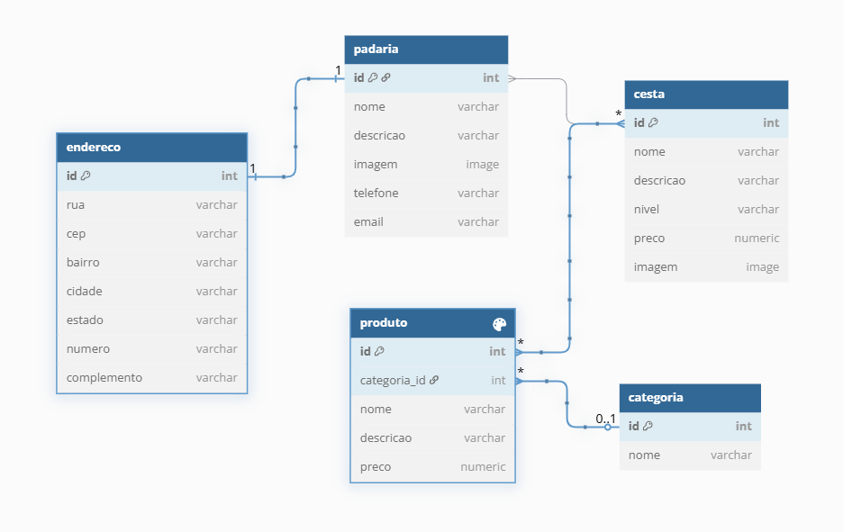

## A12 - Models e Admin

### Resumo dos Conceitos Importantes

Vamos terminar a atividade anterior criando os modelos principais do Cafe com Pão e explorar outras possibilidades do ORM. Vamos criar os modelos de dados para `Categoria`, `Produto` e `Cesta` e `Endereço`.
Nesta atividade vamos trabalhar com o Django Admin. O Django Admin é uma interface administrativa que permite a criação, edição e exclusão de dados do banco de dados dos models registrados (CRUD - Create, Retrieve, Update e Delete). O Django Admin é uma ferramenta poderosa que permite a criação de interfaces administrativas de forma rápida e eficiente. Sua vantagem é ser altamente customizável e permite a criação de interfaces administrativas complexas e personalizadas.

### Diagrama Entidade Relacionamento do Cafe com Pão


- Os principais models do Cafe com Pão são: `Categoria`, `Produto`, `Cesta` e `Endereço`
- `Categoria` representa a categoria de produtos (ex: Pães, Bolos, Doces, Salgados, Sucos, Frutas)
- `Produto` representa um produto que pode ser vendido (ex: Pão Francês, Bolo de Chocolate, Brigadeiro, Coxinha, Banana, Suco de Laranja)
- `Cesta` representa um nível de Cesta de café da manhã que pode ser assinada pelo usuário (ex: Cesta Simples, Cesta Completa, Cesta Personalizada)
- `Padaria` representa a padaria que faz parte da rede Café com Pão e vende os produtos e cestas
- `Endereço` representa o endereço de entrega do usuário

Os principais relacionamentos são:
- `Produto` pertence a somente uma `Categoria` e uma `Categoria` pode ter vários `Produtos`
- `Cesta` contém vários `Produtos` e pode ser preparada por várias `Padarias`
- `Endereço` pertence a uma `Padaria` e uma Padaria só pode ter 1 `Endereço`

### Criar Models de Categoria e Produto

- Criar os models de `Categoria` e `Produto` em `padarias/models.py`

```python
class Categoria(models.Model):
    nome = models.CharField(
        verbose_name="Nome", max_length=100, unique=True, null=False, blank=False, help_text="Nome da categoria")

    def __str__(self):
        return self.nome


class Produto(models.Model):
    nome = models.CharField(
        verbose_name="Nome", max_length=100, unique=True, null=False, blank=False, help_text="Nome do produto")
    descricao = models.TextField(
        verbose_name="Descrição", null=True, blank=True, help_text="Descrição do produto")
    preco = models.DecimalField(
        verbose_name="Preço", max_digits=10, decimal_places=2, null=False, blank=False, help_text="Preço do produto")
    categoria = models.ForeignKey(
        Categoria, on_delete=models.SET_NULL, verbose_name="Categoria", null=True, help_text="Categoria do produto")

    def __str__(self):
        return self.nome
```

- Criar as migrations para os models de `Categoria` e `Produto` com o comando `python manage.py makemigrations`
- Aplicar as migrations com o comando `python manage.py migrate`
- Verificar se as tabelas `padarias_categoria` e `padarias_produto` foram criadas corretamente no banco de dados

### Relacionamento 1-N 

- O relacionamento entre os models é feito através de chaves estrangeiras. No exemplo acima, o model `Produto` possui uma chave estrangeira para o model `Categoria`. Isso significa que um `Produto` pertence a uma `Categoria` e uma `Categoria` pode ter vários `Produtos`.
- Neste caso a chave estrangeira é do tipo `ForeignKey` que é um relacionamento de muitos para um. [Ver mais sobre relacionamentos em Django.](https://docs.djangoproject.com/en/5.0/topics/db/models/#relationships)
- Ambos os models possuem a função `__str__` que é uma função especial que retorna uma representação em string do objeto. Essa função é utilizada para exibir o objeto no Django Admin e em outras partes da aplicação. Análogo ao método `toString` em Java.

### Models de Cesta, Padaria e Endereço

- No arquivo `padarias/models.py` adicionar os models de `Cesta`, `Padaria` e `Endereço`

```python

class Padaria(models.Model):
    nome = models.CharField(
        verbose_name="Nome", max_length=100, unique=True, null=False, blank=False, help_text="Nome da padaria")
    descricao = models.TextField(
        verbose_name="Descrição", null=True, blank=True, help_text="Descrição da padaria")
    cestas = models.ManyToManyField(
        'Cesta', verbose_name="Cestas", help_text="Cestas da padaria", related_name="padarias")
    imagem = models.ImageField(
        verbose_name="Imagem", upload_to="padarias", null=True, blank=True, help_text="Imagem da padaria")
    telefone = models.CharField(
        verbose_name="Telefone", max_length=20, null=True, blank=True, help_text="Telefone da padaria")
    email = models.EmailField(
        verbose_name="E-mail", null=True, blank=True, help_text="E-mail da padaria")

    def __str__(self):
        return self.nome


class Cesta(models.Model):

    class Niveis(models.TextChoices):
        BASICO = 'B', 'Básico'
        MEDIO = 'M', 'Médio'
        PREMIUM = 'P', 'Premium'

    nome = models.CharField(
        verbose_name="Nome", max_length=100, unique=True, null=False, blank=False, help_text="Nome da cesta")
    descricao = models.TextField(
        verbose_name="Descrição", null=True, blank=True, help_text="Descrição da cesta")
    preco = models.DecimalField(
        verbose_name="Preço", max_digits=10, decimal_places=2, null=False, blank=False, help_text="Preço da cesta")
    produtos = models.ManyToManyField(
        Produto, verbose_name="Produtos", help_text="Produtos da cesta", related_name="cestas")
    nivel = models.CharField(
        verbose_name="Nível", max_length=1, choices=Niveis.choices, default=Niveis.BASICO, help_text="Nível da cesta")
    imagem = models.ImageField(
        verbose_name="Imagem", upload_to="cestas", null=True, blank=True, help_text="Imagem da cesta")

    def __str__(self):
        return self.nome


class Endereco(models.Model):
    rua = models.CharField(
        verbose_name="Rua", max_length=100, null=False, blank=False, help_text="Rua do endereço")
    numero = models.CharField(
        verbose_name="Número", max_length=10, null=False, blank=False, help_text="Número do endereço")
    complemento = models.CharField(
        verbose_name="Complemento", max_length=100, null=True, blank=True, help_text="Complemento do endereço")
    bairro = models.CharField(
        verbose_name="Bairro", max_length=100, null=True, blank=True, help_text="Bairro do endereço")
    cidade = models.CharField(
        verbose_name="Cidade", max_length=100, null=False, blank=False, help_text="Cidade do endereço")
    estado = models.CharField(
        verbose_name="Estado", max_length=2, null=False, blank=False, help_text="Estado do endereço")
    cep = models.CharField(
        verbose_name="CEP", max_length=8, null=False, blank=False, help_text="CEP do endereço")
    padaria = models.OneToOneField(
        Padaria, on_delete=models.CASCADE, verbose_name="Padaria", null=True, help_text="Padaria do endereço", related_name="endereco"
    )

    def __str__(self):
        return f"{self.rua}, {self.numero} - {self.cidade}/{self.estado}"
```

- Criar as migrations para os models de `Padaria`, `Cesta` e `Endereço` com o comando `python manage.py makemigrations`
- Aplicar as migrations com o comando `python manage.py migrate`

### Relacionamentos 1-1 e N-M

- O model `Endereço` possui um relacionamento de um para um com o model `Padaria`. Isso significa que um `Endereço` pertence a uma `Padaria` e uma `Padaria` só pode ter um `Endereço`. Neste caso a chave estrangeira é do tipo `OneToOneField` que é um relacionamento de um para um.
- O model `Padaria` possui um relacionamento de muitos para muitos com o model `Cesta`. Isso significa que uma `Padaria` pode ter várias `Cestas` e uma `Cesta` pode ser vendida por várias `Padarias`. Neste caso a chave estrangeira é do tipo `ManyToManyField` que é um relacionamento de muitos para muitos.

### Valores Fixos (Enums ou Choices)

- Muitas vezes é necessário criar campos que possuem valores fixos. Por exemplo, o campo `nivel` do model `Cesta` possui valores fixos que representam o nível da cesta (Básico, Médio, Premium). Para isso, podemos utilizar o campo `choices` que é uma lista de tuplas que representam os valores possíveis para o campo. No Django representamos isso com a classe `TextChoices` que é uma subclasse de `Choices` que representa valores de texto.
- Esse tipo de dado também é conhecido como Enumerado ou Enums.

### Django Admin

- O Django Admin é uma interface administrativa que permite a criação, edição e exclusão de dados do banco de dados dos models registrados (CRUD - Create, Retrieve, Update e Delete).
- Para registrar um model no Django Admin, é necessário criar uma classe que herda de `admin.ModelAdmin` e registrar o model com a função `admin.site.register(Model, ModelAdmin)`
- No arquivo `padarias/admin.py` registrar os models de `Categoria`, `Produto`, `Cesta`, `Padaria` e `Endereço`

```python
from django.contrib import admin
from . import models

# Register your models here.
admin.site.register(models.Categoria)
admin.site.register(models.Padaria)
admin.site.register(models.Produto)
admin.site.register(models.Cesta)
admin.site.register(models.Endereco)
```

- Para logar precisamos ter um superusuário. Criar um superusuário com o comando `python manage.py createsuperuser` e seguir as instruções
- Rodar o servidor com o comando `python manage.py runserver` e acessar o Django Admin em `http://localhost:8000/admin/`
- Logar com o superusuário criado e verificar se os models de `Categoria`, `Produto`, `Cesta`, `Padaria` e `Endereço` estão disponíveis para edição

### Atividade

- Reproduzir os passos acima
- Utilizando a ferramenta de admin do Django crie alguns registros nas categorias registradas
- Lembre de associar os produtos criados
- Navegue no banco criado com sqlitebrowser ou a extensão do VSCode Sqlite Viewer e verifique se os dados foram inseridos corretamente

